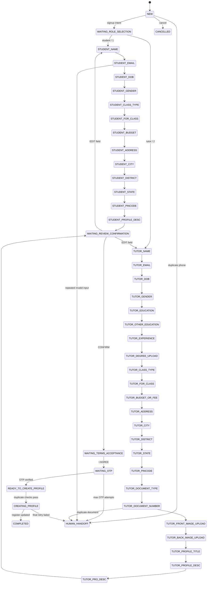
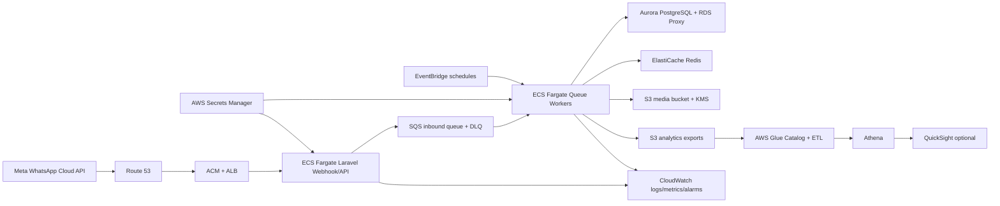

# NXtutors WhatsApp Onboarding Agent

Laravel package/module for deterministic WhatsApp student and tutor signup.

License: proprietary. See [LICENSE](LICENSE).

## What It Does

- Accepts WhatsApp signup intents such as `signup`, `I want to register`, `student signup`, and `tutor signup`.
- Uses a finite state machine persisted in Aurora PostgreSQL and cached in Redis.
- Validates every collected field before profile creation.
- Creates or updates the legacy NXtutors `register` profile through a package-scoped model and mapper.
- Keeps the legacy `frount_image` column in DB writes while exposing `front_image` internally.
- Requires separate student and tutor terms URLs.
- Generates a one-time temporary password, stores only a hash in `register.password`, keeps `c_password` null, and sets `force_password_reset=true`.
- Masks phone, email, document number, OTP, and password-like values in review/audit surfaces.
- Hands off to humans after repeated invalid replies.

## Install In Existing Laravel App

For AWS CI/CD, GitHub Actions, Terraform, and ECS deployment, see [DEPLOYMENT.md](DEPLOYMENT.md).

From the Laravel root, add the package as a path repository or copy this folder into the repo:

```json
{
  "repositories": [
    {
      "type": "path",
      "url": "nx-whatsapp-onboarding-agent"
    }
  ],
  "require": {
    "nxtutors/whatsapp-onboarding-agent": "*"
  }
}
```

Then run:

```bash
composer update nxtutors/whatsapp-onboarding-agent
php artisan migrate --path=nx-whatsapp-onboarding-agent/database/migrations
php artisan route:list | grep nxtutors.whatsapp-onboarding
```

Laravel auto-discovers `NxTutors\WhatsAppOnboarding\Bootstrap\ServiceProvider`.

## Routes

- `GET /whatsapp/onboarding/webhook` verifies the Meta webhook token.
- `POST /whatsapp/onboarding/webhook` validates the Meta signature, stores the inbound event, dispatches `ProcessInboundWhatsAppEventJob`, and returns quickly.
- `GET /api/nx-whatsapp-onboarding/health` is a simple package health endpoint.

## Required Environment

```bash
WHATSAPP_ONBOARDING_ENABLED=true
WHATSAPP_ONBOARDING_ROUTE_PREFIX=whatsapp/onboarding
WHATSAPP_ONBOARDING_QUEUE=whatsapp-onboarding

META_WHATSAPP_VERIFY_TOKEN=
META_WHATSAPP_APP_SECRET=
META_WHATSAPP_ACCESS_TOKEN=
META_WHATSAPP_PHONE_NUMBER_ID=
META_WHATSAPP_API_VERSION=v20.0
META_WHATSAPP_INTERACTIVE_ENABLED=true
META_WHATSAPP_TEMPLATE_LANGUAGE=en_US

TERMS_STUDENT_URL=
PRIVACY_STUDENT_URL=
TERMS_TUTOR_URL=
PRIVACY_TUTOR_URL=
TERMS_VERSION=current
TERMS_ALLOW_LOCAL_PLACEHOLDER=false

STUDENT_DASHBOARD_URL=
TUTOR_DASHBOARD_URL=
WHATSAPP_ONBOARDING_LOGIN_URL=
DASHBOARD_MAGIC_LOGIN_ENABLED=false

WHATSAPP_SIGNUP_ENABLED=true
WHATSAPP_STUDENT_SIGNUP_ENABLED=true
WHATSAPP_TUTOR_SIGNUP_ENABLED=true
WHATSAPP_CREATE_REAL_PROFILE=true
WHATSAPP_STUDENT_STATUS=active
WHATSAPP_TUTOR_STATUS=pending_review
WHATSAPP_TUTOR_DOCUMENTS_REQUIRE_REVIEW=true
WHATSAPP_USER_ID_PREFIX_STUDENT=NXS
WHATSAPP_USER_ID_PREFIX_TUTOR=NXT

DB_CONNECTION=pgsql
REDIS_CONNECTION=default
QUEUE_CONNECTION=redis

WHATSAPP_ONBOARDING_OTP_TTL_MINUTES=10
WHATSAPP_ONBOARDING_OTP_MAX_ATTEMPTS=3
WHATSAPP_ONBOARDING_OTP_RESEND_COOLDOWN_SECONDS=60
WHATSAPP_ONBOARDING_INDIA_PINCODE=true
WHATSAPP_ONBOARDING_ENCRYPT_SENSITIVE_DRAFTS=true
WHATSAPP_ONBOARDING_MAX_MESSAGES_PER_PHONE_HOUR=20
WHATSAPP_ONBOARDING_MAX_MESSAGES_GLOBAL_MINUTE=1000

MEDIA_STORAGE_DRIVER=s3
AWS_S3_MEDIA_BUCKET=
AWS_S3_MEDIA_PREFIX=nxtutors/onboarding
WHATSAPP_ONBOARDING_MEDIA_MAX_KB=2048
WHATSAPP_ONBOARDING_DEGREE_ALLOWS_PDF=true

WHATSAPP_ONBOARDING_INCOMPLETE_DRAFT_RETENTION_DAYS=14
WHATSAPP_ONBOARDING_RAW_WEBHOOK_RETENTION_DAYS=7
WHATSAPP_ONBOARDING_STORE_RAW_WEBHOOK_PAYLOAD=true

AWS_REGION=ap-south-1
AWS_SECRETS_MANAGER_PREFIX=/nxtutors/whatsapp-onboarding
WHATSAPP_ONBOARDING_SQS_QUEUE_URL=
WHATSAPP_ONBOARDING_EVENTBRIDGE_BUS=
```

For local development only, `.env.local.example` uses the placeholder Adobe terms URL:

```text
https://www.adobe.com/in/legal/subscription-terms.html
```

Production config validation fails if real `TERMS_STUDENT_URL`, `TERMS_TUTOR_URL`, `PRIVACY_STUDENT_URL`, and `PRIVACY_TUTOR_URL` are absent or if placeholder policy links are used without an explicit local override.

Run:

```bash
php artisan nx-whatsapp-onboarding:config-check
```

## Local Docker

From this package directory:

```bash
docker compose -f docker/docker-compose.local.yml up --build
```

The compose file starts:

- Laravel app on `http://localhost:8000`
- PostgreSQL 16
- Redis 7
- queue worker for `whatsapp-onboarding`

In a real repo, confirm the volume points at the Laravel application root containing `artisan`.

## Demo Flows

Student:

```text
User: Hey NXtutors I want to signup
Bot: Welcome to NXtutors. Please choose signup type:
     1. As a Student
     2. As a Tutor
User: 1
Bot: Please enter your full name.
...
Bot: Please open and read these before continuing:
     Terms: TERMS_STUDENT_URL
     Privacy: PRIVACY_STUDENT_URL
User: I AGREE
Bot: Sends approved OTP template.
User: 123456
Bot: Login phone, one-time temporary password, student dashboard, checklist.
```

Tutor:

```text
User: tutor signup
Bot: Welcome to NXtutors. Please choose signup type:
     1. As a Student
     2. As a Tutor
User: tutor
Bot: Please enter your full name.
...
Bot: Choose document type: Aadhaar, PAN, Passport, Driving License, or Voter ID.
...
Bot: Login phone, one-time temporary password, tutor dashboard, checklist.
```

## Conversation Engine

The engine is deterministic. Controllers only verify/store/enqueue webhook events; `ConversationOrchestrator` processes queued events with a row lock on the active conversation.

Supported commands at any point:

- `signup` starts or resumes signup.
- `student` or `1` selects student.
- `tutor` or `2` selects tutor.
- `back` moves to the previous field.
- `skip` works only for optional fields.
- `restart` asks for confirmation, then clears the draft.
- `cancel` cancels onboarding.
- `help` explains the current step.
- `human` opens a handoff ticket.
- `review` shows the masked summary.
- `edit field_name` jumps to a field and returns to review after saving.
- `I AGREE`, `AGREE`, or `YES I AGREE` accepts terms only after the role-specific terms link has been shown.

Student field order:

```text
STUDENT_NAME -> STUDENT_EMAIL -> STUDENT_DOB -> STUDENT_GENDER
-> STUDENT_CLASS_TYPE -> STUDENT_FOR_CLASS -> STUDENT_BUDGET
-> STUDENT_ADDRESS -> STUDENT_CITY -> STUDENT_DISTRICT
-> STUDENT_STATE -> STUDENT_PINCODE -> STUDENT_PROFILE_DESC
```

Tutor field order:

```text
TUTOR_NAME -> TUTOR_EMAIL -> TUTOR_DOB -> TUTOR_GENDER
-> TUTOR_EDUCATION -> TUTOR_OTHER_EDUCATION -> TUTOR_EXPERIENCE
-> TUTOR_DEGREE_UPLOAD -> TUTOR_CLASS_TYPE -> TUTOR_FOR_CLASS
-> TUTOR_BUDGET_OR_FEE -> TUTOR_ADDRESS -> TUTOR_CITY
-> TUTOR_DISTRICT -> TUTOR_STATE -> TUTOR_PINCODE
-> TUTOR_DOCUMENT_TYPE -> TUTOR_DOCUMENT_NUMBER
-> TUTOR_FRONT_IMAGE_UPLOAD -> TUTOR_BACK_IMAGE_UPLOAD
-> TUTOR_PROFILE_TITLE -> TUTOR_PROFILE_DESC -> TUTOR_PRO_DESC
```

Profile creation is blocked until required fields are present and valid, terms are accepted, OTP is verified, and duplicate phone/email/document checks pass.



## Architecture

- Controllers are thin: verify webhook, parse payload, persist idempotency event, enqueue job.
- `ConversationOrchestrator` handles the explicit FSM.
- Student and tutor question sets, flow definitions, validators, assemblers, checklist builders, and writers live in separate modules.
- `MetaMessageSender` is the single outbound WhatsApp service and includes rate limiting.
- `PostgresStateRepository` persists conversation state.
- `RedisStateCache` caches hot state by masked hash key.
- `RegisterSchemaMapper` isolates the legacy `register` schema and typo fields.
- `ProfileCreationDispatcher` receives an explicit profile creation command after validation, terms, OTP, and duplicate checks pass.
- `LoginCredentialService` generates temporary passwords; only hashes are stored.
- `DatabaseOtpService` stores OTP hashes only.
- Human handoff opens `human_handoff_tickets`.

## Database

Migrations are PostgreSQL-safe and reversible:

- `onboarding_conversations`
- `onboarding_events`
- `onboarding_audit_logs`
- `human_handoff_tickets`
- `onboarding_profile_metadata`
- `onboarding_terms_acceptances`
- safe compatibility migration for `register`

The compatibility migration:

- Adds nullable/defaulted `force_password_reset` only if missing.
- Adds PostgreSQL partial unique indexes:
  - `register.phone` where not null and not empty
  - `register.email` where not null and not empty
  - `register.document_number` where not null and not empty
- Does not drop or rewrite legacy data.

### Register Mapping

| WhatsApp/Internal field | Student `register` column | Tutor `register` column | Notes |
|---|---:|---:|---|
| `user_id` | `user_id` | `user_id` | Format defaults to `NXS-YYYY-XXXXXX` or `NXT-YYYY-XXXXXX`. |
| `name` | `name` | `name` | Validated 2-255 chars. |
| `email` | `email` | `email` | Re-checked unique before insert. |
| WhatsApp phone | `phone` | `phone` | Login identifier; normalized E.164 where possible. |
| temp password hash | `password` | `password` | Laravel `Hash::make`; plaintext never stored. |
| legacy confirm password | `c_password` | `c_password` | Always null unless a documented legacy adapter requires a hash. |
| role | `user_type`, `join_as` | `user_type`, `join_as` | `student` or `tutor`. |
| OTP verified | `otp_status` | `otp_status` | Stored as `verified` only after OTP succeeds. |
| profile status | `status` | `status` | Student defaults `active`; tutor defaults `pending_review`. |
| current timestamp | `date` | `date` | PostgreSQL-safe timestamp value. |
| `dob` | `dob` | `dob` | Optional; not future. |
| `gender` | `gender` | `gender` | `male`, `female`, `other`. |
| `class_type` | `class_type` | `class_type` | Normalized string. |
| `for_class` | `for_class` | `for_class` | Required. |
| `budget` / fee | `budget` | `budget` | Optional for student; fee for tutor. |
| address fields | `address`, `city`, `district`, `state`, `pincode` | same | Optional but asked. |
| `education` | unused | `education` | Tutor required. |
| `other_education` | unused | `other_education` | Tutor optional. |
| `experience` | unused | `experience` | Tutor required. |
| `degree_certificate` | unused | `degree` | Clean internal name maps to legacy column. |
| `document_type` | unused | `document_type` | Tutor required. |
| `document_number` | unused | `document_number` | Unique; masked in logs/audits. |
| `front_image` | unused | `frount_image` | Legacy typo preserved intentionally. |
| `back_image` | unused | `back_image` | Stored as S3/local storage key. |
| `profile` | generated optional title | `profile` | Tutor required. |
| `profile_desc` | need summary | `profile_desc` | Tutor required. |
| `pro_desc` | need summary | `pro_desc` | Tutor required. |

`force_password_reset` is recorded in `onboarding_profile_metadata` so the legacy `register` table does not have to be altered. If the safe compatibility migration adds the column, the website may also read it from `register`.

## Testing

```bash
composer install
composer test
```

Unit coverage includes:

- config shape
- state enum and allowed transition
- legacy register mapper
- student/tutor validators
- command detection and strict terms agreement variants
- login credential hashing
- user ID format generation
- dashboard signed-token URL generation
- student/tutor profile mapping
- duplicate exception safety
- media validation with fake scanner
- scenario catalog coverage for student, tutor, invalid email retry, duplicates, edit, cancel, restart, rapid messages, expired OTP, uploads, terms rejection, and HITL

Scenario fixtures live at:

```text
src/Testing/Fixtures/conversation_scenarios.json
```

## Security Notes

- Never hardcode Meta, AWS, database, or Laravel secrets.
- Use AWS Secrets Manager or environment-injected secrets in ECS.
- Do not log raw phone, email, document number, OTP, password, or temporary password.
- `c_password` is intentionally null. If a legacy login path requires it, store a hash only and document the compatibility reason before enabling.
- Temporary password is generated once, sent once over WhatsApp, stored only as a Laravel hash, and must be changed on first website login.
- If `DASHBOARD_MAGIC_LOGIN_ENABLED=true`, dashboard URLs include a signed expiring login token. Raw phone and password are never placed in URLs.
- Terms acceptance is audited in `onboarding_terms_acceptances` with hashed phone, hashed acceptance text, hashed IP/user-agent, URL, version, role, and acceptance timestamp.
- Sensitive draft fields such as tutor document numbers are encrypted in conversation context when `WHATSAPP_ONBOARDING_ENCRYPT_SENSITIVE_DRAFTS=true` and Laravel `APP_KEY` is configured.
- Completed draft sensitive fields are purged after profile creation; incomplete drafts and raw webhook payloads are governed by retention config.

### Final WhatsApp Messages

Student:

```text
Your NXtutors profile is ready ✅
Login phone: +91******1234
Temporary password: [shown once]
Dashboard: https://...

Please change your password after login.

Next steps:
1. Login to dashboard
2. Complete profile photo
3. Add learning goals
4. Browse tutors
5. Book demo/session
```

Tutor pending review:

```text
Your NXtutors profile is ready ✅
Your tutor profile is created and pending document review.

Login phone: +91******1234
Temporary password: [shown once]
Dashboard: https://...

Please change your password after login.
```

## Website Integration Guide

1. Install this package through Composer path repository and run migrations.
2. Configure `STUDENT_DASHBOARD_URL`, `TUTOR_DASHBOARD_URL`, `WHATSAPP_SIGNUP_ENABLED`, `WHATSAPP_CREATE_REAL_PROFILE`, DB, Redis, queue, Meta, and AWS/S3 env vars.
3. Keep existing email/password login unchanged. Add a separate login adapter that accepts phone + password by looking up `register.phone` and checking `register.password` with Laravel `Hash::check`.
4. On successful phone login, check `onboarding_profile_metadata.force_password_reset` or `register.force_password_reset` if adopted, then force the user to set a new password.
5. If magic login is enabled, validate the signed token with `SignedLoginTokenService`, require expiry, and exchange it for a normal website session. Do not expose phone or password in the URL.
6. For production AWS, run Aurora PostgreSQL behind RDS Proxy for connection pooling, Redis/ElastiCache for cache and queues, S3 for media, and Secrets Manager for all credentials.

## Scale Notes

Recommended AWS production shape:

- ECS/Fargate or EKS for horizontally scalable webhook and queue workers.
- Aurora PostgreSQL with RDS Proxy for connection pooling.
- ElastiCache Redis for state cache and queue/rate-limit backing.
- SQS or Redis queue with dead-letter handling.
- CloudWatch logs/metrics/alarms.
- S3 for encrypted media/document storage.
- EventBridge and Glue for downstream analytics exports.

## Production AWS



Recommended production pieces:

- Route 53, ACM, and ALB terminate HTTPS before ECS.
- ECS Fargate runs separate web and queue-worker services.
- SQS queues should use DLQs for inbound webhook, outbound message, profile creation, media download, and analytics export jobs.
- Aurora PostgreSQL should use RDS Proxy for connection pooling.
- ElastiCache Redis backs hot state, OTP/rate-limit TTLs, locks, and circuit breakers.
- S3 stores WhatsApp media and sanitized analytics exports with KMS encryption.
- Secrets Manager stores Meta tokens, app secret, verify token, DB credentials, dashboard signing key, and bucket names.
- EventBridge schedules retention cleanup, analytics export, and drift evaluation.

## Compliance And Guardrails

The flow remains deterministic and works without LLM calls. LLM extraction is disabled by default and guarded by `LlmCircuitBreaker`; validators and the state machine remain the source of truth.

Controls included:

- `PiiMasker` masks phone, email, document numbers, OTP, passwords, address, DOB, and message bodies.
- `PiiMaskingLogProcessor` is available for host Laravel logging stacks.
- `InputGuardrailService` enforces max message length, rate limits, and SQL/script injection rejection as invalid input.
- `PolicyGuardService` blocks disabled signup, disabled roles, unsafe terms/privacy config, abuse/spam, and paused onboarding.
- `WhatsAppOptOutService` supports `STOP` and `UNSUBSCRIBE` for non-transactional messages.
- `MetaMessageSender` refuses non-template messages outside the active user-initiated window when configured.
- `WhatsAppTemplateService` registers `signup_resume`, `otp_message`, `profile_created`, and `human_handoff`.
- `WHATSAPP_OUTBOUND_PAUSED` and `WHATSAPP_ONBOARDING_PAUSED` can stop messaging or the whole flow quickly.

Audit events include terms shown, terms accepted, OTP sent, OTP verified/failed, profile created, temp password issued, dashboard link issued, human handoff, and profile creation failure.

## Observability

Structured log context supports:

```text
trace_id, conversation_id_hash, wa_message_id, state_before, state_after,
event_type, latency_ms, retry_count, provider_status, error_code,
app_version, flow_version, channel
```

Metrics to publish to CloudWatch:

```text
webhook_received_count
webhook_duplicate_count
state_transition_count
validation_failed_count
otp_sent_count
otp_verified_count
profile_created_count
human_handoff_count
meta_api_error_count
queue_lag_seconds
job_failure_count
llm_call_count
llm_cost_estimate
signup_completion_rate
```

Alarm examples:

- Queue lag high.
- Error rate high.
- Profile creation failure high.
- Duplicate webhook spike.
- Meta API 429 spike.
- Aurora connections high.
- Redis memory high.
- Signup conversion drops.

Health endpoints:

- `/health/live`
- `/health/ready`
- `/health/deep` protected by Laravel `auth` middleware

## Analytics

`OnboardingAnalyticsExporter` writes sanitized JSON to:

```text
s3://bucket/nxtutors/onboarding_events/year=YYYY/month=MM/day=DD/
```

Exported fields:

```text
event_id, conversation_id_hash, role, state, event_type, error_code,
latency_ms, created_at, app_version, flow_version, channel
```

No raw phone, email, document number, OTP, password, address, or raw WhatsApp payload is exported. Glue assets live in:

```text
infra/glue/onboarding_events_etl.py
infra/glue/onboarding_events_athena.sql
```

Useful funnel metrics:

- Signup starts.
- Student completions.
- Tutor completions.
- Drop-off by state.
- Validation failure rates.
- OTP failure rates.
- Human handoff rate.
- Median and p95 latency.
- Cost per completed signup.

## Drift And Rollback

Run weekly:

```bash
php artisan nxtutors:onboarding:evaluate-drift
```

The report is written to:

```text
storage/reports/onboarding_drift_report.json
```

Rollback triggers:

- Profile creation error rate exceeds threshold.
- Meta API 429/5xx errors exceed threshold.
- Signup conversion drops below threshold.
- Duplicate account conflicts spike.
- Migration or queue release failure after deployment.
- OTP verification failures spike.
- LLM fallback rate spikes.

Feature flags for rollback:

```text
WHATSAPP_SIGNUP_ENABLED=false
WHATSAPP_STUDENT_SIGNUP_ENABLED=false
WHATSAPP_TUTOR_SIGNUP_ENABLED=false
WHATSAPP_ONBOARDING_LLM_ENABLED=false
WHATSAPP_CREATE_REAL_PROFILE=false
WHATSAPP_OUTBOUND_PAUSED=true
WHATSAPP_ONBOARDING_PAUSED=true
```

Runtime commands:

```bash
php artisan nxtutors:onboarding:pause --reason="Meta quality incident"
php artisan nxtutors:onboarding:resume
php artisan nxtutors:onboarding:export-analytics 2026-06-12
php artisan nxtutors:onboarding:privacy-delete +919999999999
php artisan nx-whatsapp-onboarding:retention-cleanup
```

## Runbook

Pause onboarding:

```bash
php artisan nxtutors:onboarding:pause --reason="incident reason"
```

Handle Meta outage:

Set `WHATSAPP_OUTBOUND_PAUSED=true`, monitor `meta_api_error_count`, keep inbound events queued, and replay outbound jobs after Meta recovers.

Handle Aurora pressure:

Set `WHATSAPP_CREATE_REAL_PROFILE=false` to collect drafts without writing final profiles, scale RDS Proxy/Aurora capacity, then replay profile creation jobs.

Rotate secrets:

Create new values in AWS Secrets Manager, deploy ECS task definition with updated secret ARNs, verify `/health/ready`, then retire old secrets.

Replay failed jobs:

Inspect DLQ messages, confirm idempotency keys, replay to the original SQS queue, and monitor `job_failure_count`.

Manually complete signup:

Open the `human_handoff_tickets` row, review masked audit logs, verify terms/OTP status, create or merge the `register` profile through the admin workflow, then close the ticket.

Rollback release:

Pause onboarding, roll ECS service to the previous task definition, verify migrations are compatible, run `/health/ready`, resume student/tutor flows gradually, and watch conversion/error alarms.
