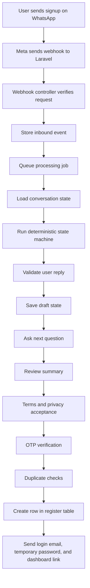

# NXtutors WhatsApp Agent Working Flow

This file explains how the WhatsApp onboarding agent works with the current NXtutors website database.

## Short Answer

Yes. The WhatsApp agent can create real student and tutor accounts in the existing website database table:

```text
register
```

For the current website setup, the database is MySQL/MariaDB and is visible in phpMyAdmin. The agent should be installed inside the existing Laravel website project, or connected to the same database connection that the website uses.

The profile is created only when:

- `WHATSAPP_CREATE_REAL_PROFILE=true`
- The user completes the WhatsApp signup flow
- Terms and privacy are accepted
- OTP is verified
- Duplicate checks pass

## Current Website Mode

Use these values for the existing NXtutors website:

```env
DB_CONNECTION=mysql
WHATSAPP_ONBOARDING_DB_CONNECTION=mysql
NXTUTORS_LEGACY_WEBSITE_MODE=true
NXTUTORS_LOGIN_IDENTIFIER=email
NXTUTORS_USER_ID_MODE=legacy_numeric

NXTUTORS_STUDENT_JOIN_AS=student
NXTUTORS_STUDENT_USER_TYPE=student

NXTUTORS_TUTOR_JOIN_AS=teacher
NXTUTORS_TUTOR_USER_TYPE=Individual

WHATSAPP_STUDENT_STATUS=t
WHATSAPP_TUTOR_STATUS=t
WHATSAPP_OTP_STATUS_VERIFIED=t

MEDIA_STORAGE_DRIVER=legacy_public_user
WHATSAPP_ONBOARDING_LOCAL_MEDIA_PATH=storage/user
WHATSAPP_ONBOARDING_MEDIA_DB_VALUE=filename_only
```

Important: The current website login is email/password. The WhatsApp number is collected, verified, and stored in `register.phone`, but the final login message should show the masked email and temporary password.

## What The User Sees

Example student signup:

```text
User: signup

Bot: Welcome to NXtutors. Please choose signup type:
1. As a Student
2. As a Tutor

User: 1

Bot: Great, let's create your student profile. What is your full name?

User: Asha Sharma

Bot: What email should we use for login and updates?

User: asha@example.com

Bot: Which class/course do you need tutoring for?

User: Class 10 Maths

Bot: What is your monthly budget? You can type a number or range.

User: 3000

Bot: Please share your city.

User: Delhi

Bot: Here is your profile summary...
Reply CONFIRM to continue, or EDIT field_name.

User: CONFIRM

Bot: Please read NXtutors Terms and Privacy Policy before account creation:
Terms: https://www.nxtutors.com/terms-conditions
Privacy: https://www.nxtutors.com/privacy-policy
Reply I AGREE to continue.

User: I AGREE

Bot: Sends OTP using approved WhatsApp OTP template.

User: 123456

Bot: Your NXtutors profile is ready.
Login email: a***@example.com
Temporary password: shown once
Login page: https://www.nxtutors.com/login
Dashboard after login: https://www.nxtutors.com/user/dashboard
Please change your password after login.
```

Tutor signup is similar, but the bot also asks for education, experience, classes/subjects, document type, document number, optional media uploads, profile title, and profile descriptions.

## Backend Flow



No controller writes directly to the `register` table. The controller only verifies the webhook, stores the event, queues a job, and returns quickly.

## When The Register Table Is Updated

The `register` table is not updated when the user first types `signup`.

The final database insert happens only after:

1. Required fields are collected.
2. Field validation passes.
3. Terms and privacy links are shown.
4. User replies `I AGREE`, `AGREE`, or `YES I AGREE`.
5. OTP is verified.
6. Duplicate phone/email/document checks pass.
7. Real profile creation is enabled.

Before that, data stays in onboarding tables:

```text
onboarding_conversations
onboarding_events
onboarding_audit_logs
onboarding_terms_acceptances
human_handoff_tickets
```

## Student Register Mapping

| WhatsApp data | `register` column |
|---|---|
| generated numeric ID | `user_id` |
| full name | `name` |
| email | `email` |
| WhatsApp phone | `phone` |
| hashed temporary password | `password` |
| no plaintext confirm password | `c_password = null` |
| student role | `user_type = student` |
| student join type | `join_as = student` |
| date of birth | `dob` |
| gender | `gender` |
| class/course type | `class_type` |
| class/course needed | `for_class` |
| budget | `budget` |
| address/city/district/state/pincode | matching address columns |
| OTP verified | `otp_status = t` |
| account status | `status = t` |
| created date/time | `date` |
| student need summary | `profile`, `profile_desc`, `pro_desc` where useful |

## Tutor Register Mapping

| WhatsApp data | `register` column |
|---|---|
| generated numeric ID | `user_id` |
| full name | `name` |
| email | `email` |
| WhatsApp phone | `phone` |
| hashed temporary password | `password` |
| no plaintext confirm password | `c_password = null` |
| tutor user type | `user_type = Individual` |
| tutor join type | `join_as = teacher` |
| education | `education` |
| other education | `other_education` |
| experience | `experience` |
| degree certificate filename | `degree` |
| class/course type | `class_type` |
| classes/subjects tutor can teach | `for_class` |
| fee/budget | `budget` |
| document type | `document_type` |
| document number | `document_number` |
| front document image filename | `frount_image` |
| back document image filename | `back_image` |
| profile title | `profile` |
| profile description | `profile_desc` |
| professional description | `pro_desc` |
| OTP verified | `otp_status = t` |
| account status | `status = t` |
| created date/time | `date` |

The old spelling `frount_image` is intentionally preserved because existing website code may already depend on that column name. Internally the module uses the cleaner name `front_image`.

## Password And Login

The agent never stores or sends a permanent plaintext password.

At the end of signup:

1. A secure temporary password is generated.
2. The user sees it once on WhatsApp.
3. Laravel stores only the hash in `register.password`.
4. `register.c_password` stays `null`.
5. The user is told to change the password after login.

Current website behavior:

```text
User opens https://www.nxtutors.com/login
User enters email + temporary password
Website checks register.email and register.password
User changes password after first login
Dashboard opens
```

If the website later adds phone login, keep it as an extra adapter. Do not remove the existing email/password login.

## Media Uploads

For the current legacy website, media should be saved in:

```text
public/storage/user
```

The `register` table should store only the filename, for example:

```text
whatsapp_degree_20260614_abcd1234.pdf
```

This matches the style many older Laravel/phpMyAdmin websites use for uploaded user files.

## Duplicate Handling

If phone already exists:

- The bot does not create a second account.
- It tells the user an NXtutors account already exists with this WhatsApp number.
- It suggests login or human support.

If email already exists:

- The bot asks the user for another email.

If tutor document number already exists:

- The bot does not reveal matched account details.
- It opens a human handoff ticket.

## Safe Rollout

Use this order:

1. Install the module in a local/staging copy of the website.
2. Point it to a copied test database first.
3. Keep `WHATSAPP_CREATE_REAL_PROFILE=false`.
4. Run `php artisan nxtutors:onboarding:preflight`.
5. Test one student signup.
6. Test one tutor signup.
7. Check the draft tables.
8. Set `WHATSAPP_CREATE_REAL_PROFILE=true` in staging.
9. Confirm a new row appears in `register`.
10. Confirm `password` is hashed.
11. Confirm `c_password` is empty/null.
12. Confirm `status=t` and `otp_status=t`.
13. Confirm website email login works.
14. Only then enable production webhook.

## Useful Commands

```bash
php artisan migrate --path=nx-whatsapp-onboarding-agent/database/migrations
php artisan nxtutors:onboarding:preflight
php artisan nxtutors:onboarding:audit-register-duplicates
php artisan nxtutors:onboarding:add-register-indexes --force
php artisan test
```

Run index changes only after duplicate checks are clean and after taking a database backup.

## Final Result

After successful signup, phpMyAdmin should show a new row in `register` with:

```text
email set
phone set
password stored as a hash
c_password null
status t
otp_status t
join_as student or teacher
user_type student or Individual
profile fields filled
media filenames saved for tutor uploads
```

That means WhatsApp signup has become a real NXtutors website account in the existing database.
