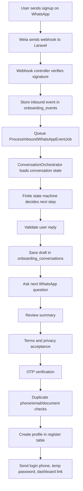

# NXtutors WhatsApp Agent Working Flow

This file explains how the WhatsApp onboarding agent works from the user's first WhatsApp message to the final website database update.

## Short Answer

Yes, the WhatsApp agent is designed to create the student or tutor account in the existing NXtutors website database table named `register`.

It will update the same website database only when:

- This package is installed inside the existing Laravel/PHP website project.
- The Laravel `.env` database settings point to the real website database.
- `WHATSAPP_CREATE_REAL_PROFILE=true`.
- The required WhatsApp signup steps are completed.

Important: the implementation was designed for AWS Aurora PostgreSQL. If your current website database is MySQL and you view it in phpMyAdmin, the profile-writing code can still use Laravel/Eloquent, but the provided compatibility/index migrations must be reviewed or adjusted for MySQL before running them. Do not run PostgreSQL-specific migrations directly on MySQL.

## What The User Sees On WhatsApp

Example student signup:

```text
User: signup

Bot: Welcome to NXtutors. Please choose signup type:
1. As a Student
2. As a Tutor

User: 1

Bot: Great, let's create your student profile. What is your full name?

User: Asha Sharma

Bot: What email should we use for login and updates?

User: asha@example.com

Bot: Which class/course do you need tutoring for?

User: Class 10 Maths

Bot: What is your monthly budget? You can type a number or range.

User: 3000

Bot: Please share your city.

User: Delhi

Bot: Here is your profile summary...
Reply CONFIRM to continue, or EDIT field_name.

User: CONFIRM

Bot: Please open and read these before continuing:
Terms: https://www.nxtutors.com/terms-conditions
Privacy: https://www.nxtutors.com/privacy-policy

Reply exactly I AGREE to continue.

User: I AGREE

Bot: Sends OTP using approved WhatsApp OTP template.

User: 123456

Bot: Your NXtutors profile is ready.
Login phone: +91******1234
Temporary password: shown once
Dashboard: student dashboard link
```

Example tutor signup is similar, but the bot also asks for education, experience, document type, document number, degree/document uploads, profile title, and profile descriptions.

## Backend Flow



## When The Website Database Is Updated

The website `register` table is not updated immediately when the user types `signup`.

The database profile is created only after all of these are true:

1. Required fields are collected.
2. Every field is valid.
3. Terms and privacy link are shown.
4. User replies exactly `I AGREE`, `AGREE`, or `YES I AGREE`.
5. OTP is verified.
6. Duplicate checks pass for phone, email, and tutor document number.
7. `WHATSAPP_CREATE_REAL_PROFILE=true`.

Until then, the data stays as an onboarding draft in:

```text
onboarding_conversations
onboarding_events
onboarding_audit_logs
onboarding_terms_acceptances
human_handoff_tickets, only if support is needed
```

## Which Website Table Gets Updated

The final website account is inserted into:

```text
register
```

The module uses this model:

```text
src/Profile/Models/Register.php
```

The actual field mapping is handled by:

```text
src/Profile/Services/RegisterSchemaMapper.php
```

That mapper protects the old website schema from random conversation data. The WhatsApp draft array does not write directly to `register`.

## Student Database Mapping

For a student, the agent writes values like this:

| WhatsApp data | `register` column |
|---|---|
| generated student ID | `user_id` |
| full name | `name` |
| email | `email` |
| WhatsApp phone | `phone` |
| hashed temporary password | `password` |
| no plaintext confirm password | `c_password = null` |
| student role | `user_type = student` |
| student join type | `join_as = student` |
| date of birth | `dob` |
| gender | `gender` |
| class/course type | `class_type` |
| class/course needed | `for_class` |
| budget | `budget` |
| address/city/district/state/pincode | matching address columns |
| OTP verified | `otp_status = verified` |
| account status | `status = active`, unless config changes it |
| created date/time | `date` |
| student need summary | `profile`, `profile_desc`, `pro_desc` where useful |

## Tutor Database Mapping

For a tutor, the agent writes values like this:

| WhatsApp data | `register` column |
|---|---|
| generated tutor ID | `user_id` |
| full name | `name` |
| email | `email` |
| WhatsApp phone | `phone` |
| hashed temporary password | `password` |
| no plaintext confirm password | `c_password = null` |
| tutor role | `user_type = tutor` |
| tutor join type | `join_as = tutor` |
| education | `education` |
| other education | `other_education` |
| experience | `experience` |
| degree certificate path | `degree` |
| class/course type | `class_type` |
| classes/subjects tutor can teach | `for_class` |
| fee/budget | `budget` |
| document type | `document_type` |
| document number | `document_number` |
| front document image | `frount_image` |
| back document image | `back_image` |
| profile title | `profile` |
| profile description | `profile_desc` |
| professional description | `pro_desc` |
| OTP verified | `otp_status = verified` |
| account status | `status = pending_review`, by default |
| created date/time | `date` |

The old spelling `frount_image` is intentionally preserved because the current website may already depend on that column name.

## Password And Login Behavior

The agent does not store permanent plaintext passwords.

At the end of signup:

1. A secure temporary password is generated.
2. The user sees it only once on WhatsApp.
3. Laravel stores only the hash in `register.password`.
4. `register.c_password` stays `null`.
5. The user is told to change the password after login.
6. A force-password-reset flag is stored in onboarding metadata, or in `register.force_password_reset` if the safe compatibility column exists.

The login identifier is the user's phone number.

If the existing website currently supports only email/password login, you need to add a small website login adapter:

```text
User enters phone + password
Laravel finds register.phone
Laravel checks password with Hash::check
If force_password_reset=true, redirect to change password page
Then open student/tutor dashboard
```

This does not break the old email/password login. It adds phone/password login as another option.

## Does It Work With The Current phpMyAdmin MySQL Database?

phpMyAdmin usually means the current website database is MySQL or MariaDB.

The answer is:

```text
Profile insert/update: yes, possible through Laravel/Eloquent.
Provided migrations/indexes: PostgreSQL-first, must be checked before MySQL use.
AWS production target: Aurora PostgreSQL.
```

If you keep MySQL for now:

1. Set Laravel `.env` to your current MySQL database:

```env
DB_CONNECTION=mysql
DB_HOST=your_mysql_host
DB_PORT=3306
DB_DATABASE=your_existing_database
DB_USERNAME=your_database_user
DB_PASSWORD=your_database_password
```

2. Install the package inside the same Laravel website.
3. Keep `WHATSAPP_CREATE_REAL_PROFILE=false` until testing is finished.
4. Review migrations before running them on MySQL, especially partial unique indexes.
5. After testing the flow, set:

```env
WHATSAPP_CREATE_REAL_PROFILE=true
```

Then new WhatsApp signups can create rows in the same `register` table visible in phpMyAdmin.

## MySQL Compatibility Warning

This package was requested and built as PostgreSQL-safe for AWS Aurora PostgreSQL.

PostgreSQL supports partial unique indexes like:

```text
unique phone where phone is not null and phone != ''
```

MySQL handles this differently. Before using the migrations on MySQL, convert the compatibility index migration to MySQL-safe indexes, or add the indexes manually in phpMyAdmin.

Do not run migrations blindly on the live website database.

## Safe Rollout Plan For Existing Website

Use this order:

1. Install the package in a local/staging copy of the website.
2. Point it to a copied test database, not production.
3. Set:

```env
WHATSAPP_CREATE_REAL_PROFILE=false
```

4. Send test WhatsApp messages and verify draft rows are created.
5. Run one student and one tutor test signup.
6. Check validation, terms, OTP, and review summary.
7. Set:

```env
WHATSAPP_CREATE_REAL_PROFILE=true
```

8. Run one test student signup.
9. Confirm a new row appears in `register`.
10. Confirm password is hashed and `c_password` is null.
11. Confirm phone login works on the website.
12. Repeat for tutor signup.
13. Only then enable production webhook.

## What Happens If A Duplicate Account Exists

If phone already exists:

- The bot does not create a second account.
- It tells the user the phone already has an NXtutors account.
- It can open a human support ticket.

If email already exists:

- The bot asks the user for another email.

If tutor document number already exists:

- The bot does not reveal which account matched.
- It opens a human handoff ticket for safe manual review.

## What Happens If Something Fails

If Meta WhatsApp API fails:

- Messages retry with backoff.
- Events remain stored.
- Workers can retry later.

If database is down:

- Webhook events are already stored or queued where possible.
- Profile creation can retry.
- The user can be moved to human handoff.

If user gives invalid input too many times:

- The bot opens a human handoff ticket.

If signup is paused:

- The bot stops new onboarding.
- `STOP` and `UNSUBSCRIBE` still work.

## Final Result In Website

After a successful signup, the website database has:

```text
register row created
phone set as login identifier
password stored as hash
c_password null
otp_status verified
student status active or tutor status pending_review
student/tutor profile fields filled
document/media paths saved for tutor when uploaded
```

The user receives:

```text
masked login phone
temporary password shown once
dashboard link
next-step checklist
```

That means the WhatsApp signup becomes a real NXtutors website profile, as long as the package is connected to the same database that your website uses.
